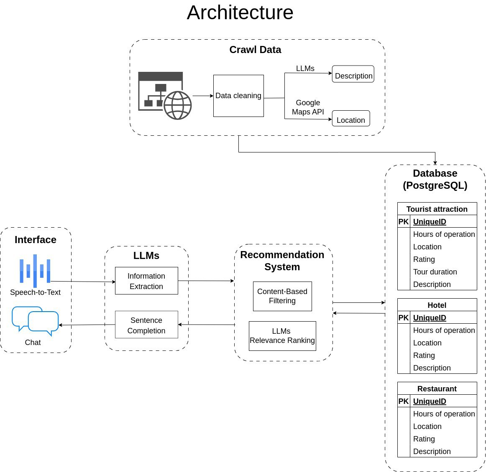

# Travel-Recommendation-System

## Architecture

1. **Crawl Data**
- Data Cleaning: Quá trình làm sạch dữ liệu thô để đảm bảo chất lượng cao cho việc sử dụng sau này.
- LLMs: Được sử dụng để tạo mô tả từ dữ liệu thu thập được.
- Google Maps API: Cung cấp vị trí và các thông tin địa lý liên quan.
2. **Database**
- Tourist Attraction: Lưu trữ thông tin về các điểm tham quan, bao gồm thời gian hoạt động, vị trí, đánh giá, thời lượng tour, và mô tả.
- Hotel: Chứa thông tin về khách sạn, bao gồm thời gian hoạt động, vị trí, đánh giá, và mô tả.
- Restaurant: Lưu trữ thông tin về các nhà hàng, bao gồm thời gian hoạt động, vị trí, đánh giá, và mô tả.
3. **Recommendation System**
- Content-Based Filtering: Hệ thống đề xuất dựa trên nội dung đã biết để gợi ý các địa điểm và dịch vụ phù hợp.
- LLMs Relevance Ranking: Sử dụng mô hình ngôn ngữ lớn để xếp hạng mức độ phù hợp của các đề xuất.
4. **LLMs**
- Information Extraction: Trích xuất thông tin quan trọng từ yêu cầu của người dùng.
- Sentence Completion: Hoàn thiện các câu truy vấn để giúp hệ thống hiểu rõ hơn về nhu cầu của người dùng.
5. **Interface**
- Speech-to-Text: Chuyển đổi giọng nói thành văn bản để xử lý yêu cầu của người dùng.
- Chat: Giao diện trò chuyện giữa người dùng và hệ thống, nơi người dùng có thể nhập yêu cầu và nhận phản hồi.

## Crawl Data

## Database

## Recommendation System

## speech2text

## LLMs