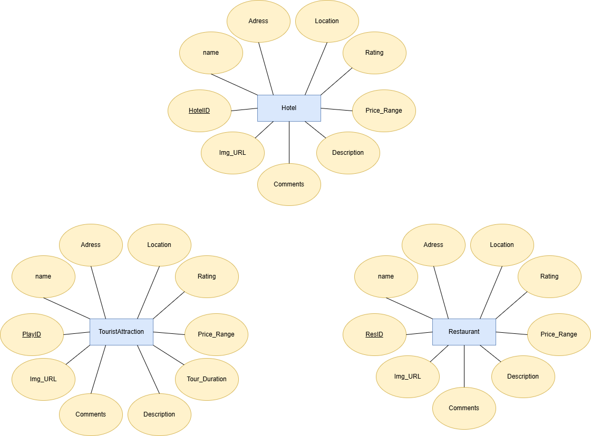

# Database

## ERD

# ERD Description

This diagram represents the Entity-Relationship Diagram (ERD) for a travel recommendation system. The system consists of three main entities: **Hotel**, **Restaurant**, and **TouristAttraction**. Each entity is associated with several attributes that define its characteristics. 
Additionally, there are two tables to manage prices: **HotelPrice** and **AttractionPrice**. These tables allow for a more detailed breakdown of pricing structures.

## Entities and Attributes

### Hotel
- **HotelID**: Unique identifier for each hotel.
- **name**: The name of the hotel.
- **Adress**: The address of the hotel, including details, street,district and city.
- **Location**: Geographical location of the hotel, including Latitude and Longitude
- **Rating**: Customer rating of the hotel.
- **Img_URL**: URL for images of the hotel.
- **Description**: A description of the hotel.
- **Comments**: User comments on the hotel.

### HotelPrice
- **HPriceID**: Unique identifier for the hotel price entry
- **HotelID**: Foreign Key referencing the `Hotel` table
- **RoomType**: Type of room available at the hotel
- **Capacity**: Room capacity
- **Price**: Price of the room

### Restaurant
- **ResID**: Unique identifier for each restaurant.
- **name**: The name of the restaurant.
- **Adress**: The address of the restaurant, including details, street,district and city.
- **Location**: Geographical location of the restaurant, including Latitude and Longitude
- **Rating**: Customer rating of the restaurant.
- **Price_Range**: The price range of meals at the restaurant.
- **Img_URL**: URL for images of the restaurant.
- **Description**: A description of the restaurant.
- **Comments**: User comments on the restaurant.

### TouristAttraction
- **AttractionID**: Unique identifier for each tourist attraction.
- **name**: The name of the tourist attraction.
- **Adress**: The address of the tourist attraction, including details, street,district and city.
- **Location**: Geographical location of the tourist attraction, including Latitude and Longitude
- **Rating**: Customer rating of the tourist attraction.
- **Tour_Duration**: Typical duration of a tour at the attraction.
- **Img_URL**: URL for images of the tourist attraction.
- **Description**: A description of the tourist attraction.
- **Comments**: User comments on the tourist attraction.

### AttractionPrice
- **APriceID**: Unique identifier for the attraction price entry
- **AttractionID**: Foreign Key referencing the `TouristAttraction` table
- **TicketType**: Type of ticket available for the attraction
- **NumberPeople**: Number of people the ticket covers
- **Price**: Price of the ticket

---

This ERD represents the core entities in a travel recommendation system database, focusing on providing users with information about hotels, restaurants, and tourist attraction, along with detailed pricing information for hotels and attractions. Relationships are established to connect pricing details with their corresponding entities.

