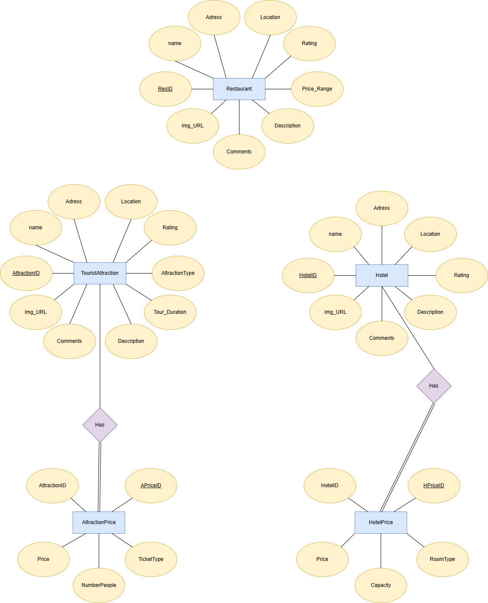

# Database

## ERD

# ERD Description

This diagram represents the Entity-Relationship Diagram (ERD) for a travel recommendation system. The system consists of three main entities: **Hotel**, **Restaurant**, and **TouristAttraction**. Each entity is associated with several attributes that define its characteristics.

## Entities and Attributes

### Hotel
- **HotelID**: Unique identifier for each hotel.
- **name**: The name of the hotel.
- **Adress**: The address of the hotel, including details, street,district and city.
- **Location**: Geographical location of the hotel, including Latitude and Longitude
- **Rating**: Customer rating of the hotel.
- **Price_Range**: The price range of the hotel.
- **Img_URL**: URL for images of the hotel.
- **Description**: A description of the hotel.
- **Comments**: User comments on the hotel.

### Restaurant
- **ResID**: Unique identifier for each restaurant.
- **name**: The name of the restaurant.
- **Adress**: The address of the restaurant, including details, street,district and city.
- **Location**: Geographical location of the restaurant, including Latitude and Longitude
- **Rating**: Customer rating of the restaurant.
- **Price_Range**: The price range of meals at the restaurant.
- **Img_URL**: URL for images of the restaurant.
- **Description**: A description of the restaurant.
- **Comments**: User comments on the restaurant.

### TouristAttraction
- **PlayID**: Unique identifier for each tourist attraction.
- **name**: The name of the tourist attraction.
- **Adress**: The address of the tourist attraction, including details, street,district and city.
- **Location**: Geographical location of the tourist attraction, including Latitude and Longitude
- **Rating**: Customer rating of the tourist attraction.
- **Price_Range**: The price range for entry or activities at the ptourist attraction.
- **Tour_Duration**: Typical duration of a tour at the attraction.
- **Img_URL**: URL for images of the tourist attraction.
- **Description**: A description of the tourist attraction.
- **Comments**: User comments on the tourist attraction.

---

This ERD represents the core entities in a travel recommendation system database, focusing on providing users with information about hotels, restaurants, and tourist attraction.

